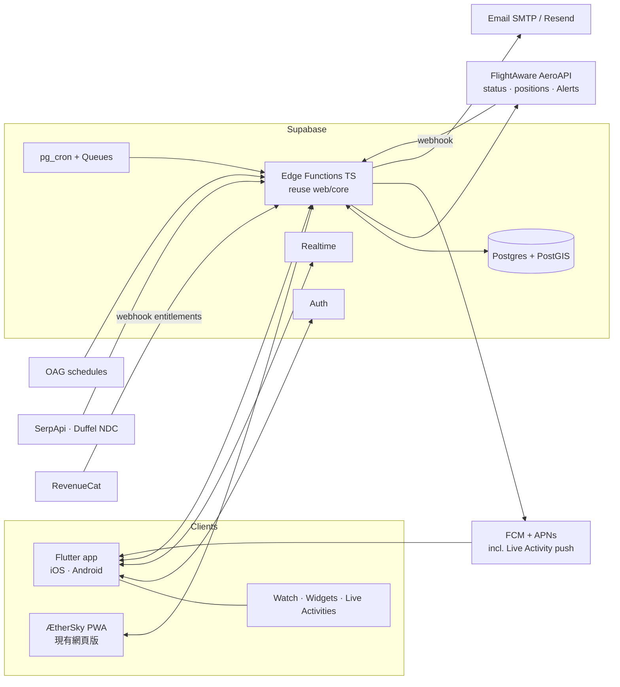

# ÆtherSky — 產品與技術計畫 · Product & Technical Plan

> 版本 v1 · 2026-09-28 · 給 Sean & Blue。For Sean & Blue.
> 範圍：把「商務艙雷達」PWA 升級為 **ÆtherSky** 品牌，並規劃一個 iOS + Android 的航班追蹤 App（對標 Flighty，但要更好）。
> Scope: rebrand the PWA as ÆtherSky and plan a cross-platform flight-tracking app that beats Flighty.

---

## 0. 一頁摘要 · TL;DR

| | 決定 Decision | 為什麼 Why |
|---|---|---|
| 品牌 | **ÆtherSky**（PWA 已改名） | 一個品牌涵蓋票價雷達 + 航班追蹤 + 會員／貴賓室 |
| 跨平台 | **Flutter**（客戶端）+ 原生小擴充（Live Activities、Widgets、Watch） | 一套 UI 兩個平台、自繪 UI 適合 Flighty 級質感、Sean 已偏好 |
| 後端 | **Supabase**（Postgres + Auth + Realtime + Edge Functions TS） | SQL、列級權限 RLS、即時推送、TypeScript 可直接重用現有 `web/core/*.js` |
| 航班資料 | **FlightAware AeroAPI**（即時＋推播 Alerts）＋ **OAG**（班表）＋ AeroDataBox（便宜備援） | 業界資料品質；Alerts 用 webhook 推送，不必一直輪詢 → 省錢 |
| 票價 | SerpApi（Google Flights，現有）＋ Duffel（NDC，可訂位） | GDS 直連需商業合約／認證，先走 NDC 聚合商 |
| 付費 | Free / **Pro** / **Elite** / Family，RevenueCat 管理訂閱 | 競品免費的我們也免費；錢收在「高端常客才需要」的功能 |
| 差異化 | 雙平台同步上線、亞洲（繁中/韓文）優先、商務艙票價情報、會員＋貴賓室＋快速通關 | Flighty 只做 iOS、不做票價、不做會員／貴賓室 |

⚠️ **市場更新**：「Android 沒有 Flighty」已不完全成立 — **Aviate**（Flighty 風格的 Android App）已於 2026-07-27 上架。
我們的切入點因此不是「第一個」，而是「給高端常客、亞洲市場、票價＋會員＋機場服務一站完成」。

---

## 1. 市場現況 · Market reality check（2026-09）

| App | 平台 | 免費 Free | 付費 Paid | 價格 Price |
|---|---|---|---|---|
| **Flighty** | iOS / iPad / Mac only（Android 只有等候名單） | 無限航班追蹤、即時資料、Passport、Friends | 提前航空公司的延誤預警、Live Activities、日曆同步、Email/TripIt 匯入、機場延誤趨勢、Connection Assistant、無限歷史 | US$4.99/月 · **US$59.99/年**（官網）；家庭方案、終身方案另計 |
| **Aviate** | Android（2026-07 上架） | 基本追蹤 | 詳細資料與指標 | US$1.99/週 · **US$39.99/年** · US$199.99 終身 |
| **Flightradar24** | iOS / Android | 即時地圖、基本航班資訊 | Silver：90 天歷史、篩選與提醒；Gold：365 天、天氣圖層、航路 | Silver ≈ US$1.49/月 · Gold ≈ US$3.49/月（依地區） |
| **TripIt** | iOS / Android | 轉寄確認信自動建行程 | Pro：即時航班提醒、座位追蹤、票價追蹤、機場地圖 | **US$49/年** |
| **Google Flights** | Web | **票價追蹤 Email（免費）** | — | 免費 |
| **Priority Pass** | iOS / Android | 貴賓室目錄 | 會員才能進 | 會員費 |

來源 Sources：[Flighty pricing](https://flighty.com/pricing) · [Flighty Android waitlist](https://flighty.com/android-waitlist) · [Aviate launch (9to5Google)](https://9to5google.com/2026/07/27/aviate-androids-answer-to-flighty-is-now-available-to-download/) · [FR24 plans](https://eathealthy365.com/a-breakdown-of-each-flightradar24-subscription-plan/) · [TripIt pricing](https://www.tripit.com/web/pro/pricing)

**結論 Takeaways**
1. 免費底線 = 無限航班追蹤 + 即時狀態 + 基本推播 + Email 匯入 + 票價追蹤 Email。這些我們一律免費。
2. Flighty 的護城河是「資料品質 + iOS 原生質感」。我們用 Flutter 自繪 UI + 原生 Live Activity 擴充追上質感，用資料供應商（FlightAware）追上品質。
3. 沒有任何一家把「航班追蹤 × 商務艙票價 × 會員等級 × 貴賓室/快速通關」整合 — 這就是 ÆtherSky 的位置。

---

## 2. 定位與「比 Flighty 更好」· Positioning

**一句話**：ÆtherSky 是給常飛商務艙旅客的「飛行管家」— 從找票、追價、飛行、轉機到貴賓室，一個 App 完成。
*The flight companion for premium frequent flyers: find the fare, track the flight, own the airport.*

| 面向 | Flighty | ÆtherSky 做法 |
|---|---|---|
| 平台 | iOS only | **iOS + Android 同步**、PWA 網頁版、Apple Watch + Wear OS |
| 語言市場 | 英文為主 | **繁中 / 韓文 / 英文**，台灣、韓國、東南亞航點優先 |
| 票價 | 無 | 商務艙好價雷達、Real Tracker（固定/彈性日期）、外站票、外國站結帳（**PWA 已有**） |
| 會員 | 無 | 會員卡夾（**PWA 已有**）、等級進度、到期提醒、「這班累積到哪個計畫最划算」 |
| 機場 | 延誤趨勢（Pro） | 貴賓室指南＋評價、依你的卡/等級判斷能不能進、快速通關預約、安檢排隊時間 |
| 中斷處理 | 提前預警、替代航班 | ＋賠償申請（EU261 等）、自動改票建議、轉機風險預測 |
| 旅客偏好 | — | 天合聯盟優先、排除中/港/澳航段（沿用現有政策，可設定） |
| AI | — | Claude 旅行助理：自然語言找票、整理貴賓室評論、延誤時幫你擬改票方案 |

---

## 3. 技術選型 · Stack decision

| 選項 | 優點 | 缺點 | 評分 |
|---|---|---|---|
| **Flutter** ✅ | 一套程式碼、Impeller 自繪 UI 效能好、動畫/地圖/時間軸容易做出 Flighty 質感；Live Activities / Android Live Updates / Widgets 都有成熟外掛＋原生擴充 | Dart 需另學；Widgets/Live Activity 仍要寫少量 Swift/Kotlin | ★★★★★ |
| React Native (Expo) | 可直接重用現有 JS 核心邏輯；Expo 生態好 | 高度自訂動畫、複雜地圖效能較吃力；原生擴充一樣要寫 | ★★★★ |
| Kotlin Multiplatform | 原生 UI、共用商業邏輯 | 兩套 UI（SwiftUI + Compose）→ 工作量約 1.6 倍 | ★★★ |
| 各寫原生 | 最佳體驗 | 兩倍人力與時間 | ★★ |

**建議：Flutter（客戶端）+ Supabase Edge Functions（TypeScript，後端）**。
商業邏輯（排除政策、評分、追蹤規則）放後端，用 TypeScript **直接重用** `web/core/*.js`，所以選 Flutter 不會失去現有程式碼的價值。

**必要原生擴充 Native extensions**
- iOS：Live Activities + Dynamic Island（ActivityKit + WidgetKit，Swift）、主畫面小工具、Apple Watch app、Siri Shortcuts、Apple Wallet 登機證解析
- Android：Android 16 **Live Updates**（進度型持續通知）、Glance 主畫面小工具、Wear OS tile
- Flutter 套件：`live_activities` / `live_activity_kit`、`home_widget`、`firebase_messaging`、`purchases_flutter`（RevenueCat）

---

## 4. 系統架構 · Architecture

**資料流（追蹤一班航班）**
1. 使用者輸入 `BR 198 · 2026-12-20` 或轉寄訂位確認信 → Edge Function 查 AeroAPI／OAG → 建 `flights` + `user_flights`。
2. 後端向 AeroAPI 註冊 **Alert**（起飛、延誤、登機門、改降…）→ 事件經 webhook 進來，寫 `flight_events`。
3. Realtime 推到 App；FCM/APNs 發推播；iOS 同時更新 Live Activity（APNs push token）。
4. 起飛前 T-24h/T-3h 另外補查一次（登機門、inbound 飛機）→ 預測延誤。

**省錢原則**：用 Alerts（被動推送）取代輪詢；同一航班多位使用者只查一次（`flights` 共用，`user_flights` 只是關聯）；票價查詢同一航線同日期全體共用結果。

---

## 5. 資料來源與成本 · Data providers

| 需求 | 首選 Primary | 備援 / 便宜方案 | 成本參考（需向廠商確認） |
|---|---|---|---|
| 即時航班狀態、位置、推播 Alerts | **FlightAware AeroAPI v3** | AeroDataBox、Aviationstack | AeroAPI：Personal 每月免費額度 US$5、Standard 最低 US$100/月、Premium 最低 US$1,000/月；按查詢計費，最低約 US$0.002/次（依 endpoint） |
| 班表、未來航班、共掛航班 | **OAG Flight Info API** | Cirium（報價制）、AeroDataBox | OAG 有免費試用層；商用報價制 |
| 地圖軌跡 | AeroAPI（含） | ADS-B Exchange / FR24 API（商用授權需確認） | OpenSky **禁止商用**，不採用 |
| 票價 | SerpApi（Google Flights） | **Duffel**（NDC，可直接出票） | SerpApi 付費約 US$0.015/次；Duffel 依訂位收費 |
| 里程兌換位 | seats.aero 合作 API | — | 需簽合作 |
| 機場資料 | OurAirports（公有領域） | — | 免費 |
| 貴賓室 | LoungeReview API、DragonPass API、Priority Pass 合作 | 自建使用者評價 | 合作洽談 |
| 快速通關 | Priority Pass+（2026 擴大到 170+ 條通道）、HighPass（400+ 機場） | 機場官方預約（DXB marhaba、DUB…） | 聯盟行銷分潤 |
| 天氣 | aviationweather.gov METAR/TAF、Open-Meteo | — | 免費 |

**GDS 說明**：Amadeus / Sabre / Travelport 直連需要商業合約，通常還要 IATA/ARC 認證或透過 host agency；Amadeus Self-Service API 已於 2026-07-17 停止。
→ **Phase 1–2 用 NDC 聚合商 Duffel**（已整合在 `scripts/providers/duffel.mjs`），確定要自己賣票時再談 Sabre Dev Studio / Travelport+。

---

## 6. 資料庫設計 · Database（Supabase Postgres）

完整 SQL：[`backend/supabase/migrations/0001_init.sql`](../../backend/supabase/migrations/0001_init.sql)

| 資料表 | 用途 | 重點欄位 |
|---|---|---|
| `profiles` | 使用者設定 | locale、home_airport、alliance_pref、exclude_cn_hk_mo |
| `subscriptions` | 訂閱權益（RevenueCat webhook 寫入） | tier `free/pro/elite`、expires_at |
| `airports` / `airlines` | 參考資料 | IATA、country、alliance、PostGIS 位置 |
| `flights` | **共用**航班實體（一班只存一份） | carrier + number + 日期、預定/預估/實際時間、登機門、機型、tail、inbound |
| `user_flights` | 使用者追蹤的航班 | 座位、艙等、訂位代號、分享設定 |
| `flight_events` | 狀態變化事件流 | kind（delay/gate/cancel…）、payload、source |
| `fare_trackers` / `fare_samples` | Real Tracker（與 PWA 同格式） | 固定/彈性日期、目標價、每日最低價 |
| `memberships` | 會員卡夾 | **號碼以 client-side 加密後儲存**（使用者金鑰，伺服器看不到明文） |
| `lounges` / `lounge_reviews` | 貴賓室與評價 | 航廈/管制區、開放時間、進入規則、評分、照片 |
| `devices` | 推播 token | FCM token、APNs Live Activity token |

所有使用者資料表開啟 **RLS**：`user_id = auth.uid()`。個資法（台灣）、PIPA（韓國）、GDPR：提供匯出與刪除帳號。

---

## 7. 功能範圍與里程碑 · Scope & roadmap

| 階段 | 時間（估） | 內容 | 狀態 |
|---|---|---|---|
| **P0 PWA 升級** | 本 PR | ÆtherSky 改名、Real Tracker（固定/彈性日期＋Email/推播通知）、會員卡夾、Flutter 專案骨架、Supabase schema | ✅ 本次完成 |
| **P1 MVP** | 6–8 週 | 帳號登入、新增航班（航班號/日期）、即時狀態、推播、Live Activity / Live Updates、航班時間軸、地圖、Passport 基本統計、PWA 票價追蹤搬進 App | 🔜 |
| **P2 Pro** | +6 週 | Email 轉寄匯入、日曆同步、轉機助理、inbound 飛機追蹤、延誤預測、機場延誤趨勢、RevenueCat 付費牆、家庭方案 | |
| **P3 Elite** | +8 週 | 貴賓室指南＋評價、快速通關預約、會員等級進度、里程兌換位提醒、AI 助理、賠償申請 | |
| **P4 擴張** | 之後 | Apple Watch / Wear OS、CarPlay/Android Auto、企業版、NDC 直接訂位 | |

**上架清單 Store checklist**：Apple Developer（US$99/年）、Google Play（US$25 一次）、隱私權政策、訂閱條款、App Store 的「訂閱自動續訂」說明、韓國／台灣在地付款與稅務（由商店代收）。

---

## 8. 訂閱方案 · Subscription model

**原則**：① 競品免費的功能我們免費；② 付費價值集中在「高端常客才會在乎」的功能；③ 第一趟旅程送 Elite 體驗（學 Flighty 的首航免費，但更大方）。

| 功能 | Free | **Pro** | **Elite** |
|---|---|---|---|
| 無限航班追蹤、即時狀態、地圖 | ✅ | ✅ | ✅ |
| 基本推播（延誤、登機門、取消、起降） | ✅ | ✅ | ✅ |
| Live Activity / Android Live Updates / Widgets | ✅（Flighty 收費，我們免費） | ✅ | ✅ |
| Passport 飛行紀錄與統計（無限歷史） | ✅ | ✅ | ✅ |
| 朋友/家人分享、接機模式 | ✅ | ✅ | ✅ |
| Email 轉寄匯入（TripIt 免費） | ✅ | ✅ | ✅ |
| 票價追蹤 Real Tracker（Google 免費） | 固定日期 ×5，每日 | 無限、**彈性日期** | 無限、彈性、**每 6 小時** |
| 商務艙好價雷達 | 每日摘要 | 完整＋外站票＋外國站結帳 | ＋錯誤票價即時推播 |
| 會員卡夾 | ✅ 本機 | ✅ 加密雲端同步 | ✅ ＋等級進度、到期提醒 |
| 提前預警（比航空公司早）、延誤預測、inbound 飛機 | — | ✅ | ✅ |
| 日曆同步、轉機助理、機場延誤趨勢 | — | ✅ | ✅ |
| 貴賓室指南（看資訊） | ✅ | ✅ | ✅ |
| 貴賓室「我能不能進」判斷、評價全文、擁擠度 | — | ✅ | ✅ |
| 里程兌換位提醒（award alerts） | — | — | ✅ |
| AI 旅行助理（Claude） | — | 每月 20 次 | 無限（合理使用） |
| 快速通關／貴賓室單次券折扣、賠償申請協助 | — | — | ✅ |
| 優先客服 | — | — | ✅ |

**建議價格（可再調）**

| 方案 | 月 | 年 | 台幣年費參考 | 對標 |
|---|---|---|---|---|
| Pro | US$6.99 | **US$49.99** | NT$1,590 | TripIt Pro US$49、Flighty US$59.99、Aviate US$39.99 |
| Elite | US$14.99 | **US$119.99** | NT$3,790 | 相當於一次貴賓室單次券的價格 |
| Family（Pro × 6 人） | — | US$89.99 | NT$2,890 | Flighty Family |
| Elite Family（× 6 人） | — | US$179.99 | NT$5,690 | — |

- **首趟免費**：第一趟追蹤的旅程（出發前 7 天到落地）全功能 Elite。
- **暫不賣終身方案**：資料 API 是持續成本；若要募早期資金，可限量 1,000 份「Founder Pro 終身」US$249。
- 在地定價：用商店的區域價格（台灣、韓國較低；日本、美國標準）。

**單位經濟（粗估，需以實際報價校正）**
- 航班資料：Alerts 模式下每個被追蹤航班約 US$0.01–0.10（依 endpoint 組合）；共用 `flights` 讓熱門航班成本攤提。
- 票價：同航線同日期共用；免費用戶 5 個追蹤 × 每日 1 次 × 30 天 ≈ 150 次/月，若全部獨立約 US$2.25 → **一定要做共用與快取**，並讓免費追蹤在熱門日期共用結果。
- 付費轉換目標 4–6%（高端常客 TA 可望更高）。

---

## 9. 延伸功能腦力激盪 · Brainstorm

依類別；標註 **[F]** Free、**[P]** Pro、**[E]** Elite、**$** 可分潤。

**A. 機場 Airport**
- 貴賓室指南：航廈、管制區內/外、步行時間、開放時間、淋浴/睡眠艙/餐飲、照片 **[F]**
- 「我能進嗎？」：依票價艙等 + 會員卡夾等級 + 信用卡（Priority Pass、Amex 等）自動判斷 **[P]**
- 評價系統：評分、擁擠度回報、菜單照片；AI 摘要「這間值得進嗎」**[P]**
- 快速通關 / 快速安檢預約（Priority Pass+、HighPass、機場官方）**[E] $**
- 安檢排隊時間（有公開資料的機場）＋「該幾點出門」建議 **[P]**
- 接送機：禮車（部分商務艙含接送：EK、EY、AF La Première）、機場快線時刻 **[E] $**
- Meet & Greet / VIP 通道（marhaba、Plaza Premium）**[E] $**
- 機場地圖、登機門步行時間、轉機最短路徑 **[P]**

**B. 座位與艙等 Seat & cabin**
- 依航班機型顯示實際商務艙產品（例：星宇 A350 Suite、長榮 787 反向魚骨）**[F]**
- 最佳座位推薦（王座、獨立座、靠窗）與座位提醒（好位子釋出時通知）**[P]**
- 升等／競標升等（Plusgrade 類）提醒 **[E]**
- 機上 Wi-Fi、電源、餐點資訊 **[F]**

**C. 會員與里程 Loyalty**
- 會員卡夾（PWA 已完成）→ App 加密同步 **[F/P]**
- 等級進度：已飛里程/航段/點數、距離下一級差多少、到期提醒 **[E]**
- 「這班累積到哪裡最划算」：依聯盟與艙等回饋比例計算 **[P]**
- 里程兌換位提醒（seats.aero 類）＋ 現金 vs 里程比較器 **[E]**
- 等級匹配 / 挑戰（status match）機會通知 **[E]**

**D. 中斷處理 Disruption**
- 提前預警（inbound 飛機延誤、機場流量管制）**[P]**
- 取消時：立即列出替代航班與可用座位、改票話術 **[P]**
- 賠償申請（EU261、加拿大 APPR、韓國/台灣消保規定）與 AirHelp 類合作 **[E] $**
- 轉機風險分數（最短轉機時間 MCT、航廈、歷史準點）**[P]**

**E. 票價情報 Fare intelligence（PWA 已有基礎）**
- 商務艙好價雷達、Real Tracker、外站票、外國站結帳 **[F/P]**
- 錯誤票價即時推播 **[E]**
- 以會員等級/聯盟偏好個人化排序 **[P]**

**F. 身心 Wellness**
- 時差調整計畫（光照、睡眠、咖啡因時段）**[P]**
- 機上睡眠建議：依航班時段與座位 **[P]**

**G. 社交 Social**
- 分享即時航班（家人不用裝 App 也能看網頁）**[F]**
- 接機模式：接機的人收到「預計抵達出口時間」**[F]**
- 年度飛行回顧（Wrapped 風格影片，可分享）→ 成長迴圈 **[F]**

**H. 證件 Documents**
- 護照、簽證到期提醒；入境需求（Visit Japan Web、K-ETA、台灣入境卡）**[F]**
- eSIM、旅遊保險 **$**

**I. AI（Claude）**
- 自然語言：「12 月去巴黎、天合聯盟、商務艙、10 萬以內」→ 自動建立 Real Tracker **[P/E]**
- 延誤時的改票助理、貴賓室評論摘要、行程整理 **[P/E]**

**J. 整合 Integrations**
- 日曆、Gmail/Outlook 匯入、TripIt 匯入、Apple Wallet 登機證、Apple Watch / Wear OS、CarPlay / Android Auto **[P]**

**優先順序建議（最高 ROI）**：① 貴賓室「我能進嗎」＋評價 ② 里程兌換位提醒 ③ 會員等級進度 ④ 快速通關預約（分潤）⑤ AI 找票。

---

## 10. 營運成本估算 · Running cost（月，粗估）

| 規模 | Supabase | 航班資料 | 票價 | 推播/Email | 合計 |
|---|---|---|---|---|---|
| 內部測試（Sean & Blue） | Free | AeroAPI Personal（≤US$5 免費） | SerpApi 免費 250 次 | 免費 | **≈ US$0** |
| 1k MAU | US$25 | US$100–300 | US$50–150 | US$0–20 | ≈ US$200–500 |
| 10k MAU | US$25–100 | US$1,000–3,000 | US$300–800 | US$50 | ≈ US$1.5k–4k |

10k MAU × 5% 付費 × US$49.99/年 ≈ US$2,080/月收入（扣商店 15–30%）→ 需要 Elite 與分潤撐起毛利，或提高付費率。

---

## 11. 風險 · Risks

| 風險 | 對策 |
|---|---|
| 航班資料成本失控 | Alerts 取代輪詢；航班共用；免費層合理使用上限 |
| 資料授權（FR24 / OpenSky 商用限制） | 只用有商用授權的來源（FlightAware、OAG、AeroDataBox） |
| App Store 審核（訂閱、隱私標籤） | 首發前完成隱私權政策、資料用途標籤、恢復購買 |
| 會員號碼外洩 | 客戶端加密（伺服器只存密文）；PWA 版只存本機 |
| Aviate 先發 | 定位高端＋亞洲＋票價/會員/機場整合，不打純追蹤的價格戰 |
| 小團隊時間 | Flutter 單一程式碼；後端重用 JS；Claude Code 協作 |

---

## 12. 本次已完成與下一步 · Done now & next

**本 PR 已完成**
- ✅ PWA 改名 **ÆtherSky**（標題、App 名稱、manifest、推播／Email 品牌）
- ✅ **Real Tracker**：航線追蹤分頁 → 指定日期或彈性日期（±1～7 天）、艙等、轉機、目標價、通知對象；每日掃描自動查價；降價／找到更便宜日期／達標價／（可選）漲價 → **Email + ntfy 推播**
- ✅ 追蹤清單同步：Vercel Function → 私人 GitHub Variable `TRACKERS`（兩組密碼登入保護，密碼決定是 Sean 或 Blue）
- ✅ **會員卡夾**：新分頁，28 個常客計畫、等級建議、到期提醒、號碼遮蔽/複製、匯出/匯入備份；好價詳情顯示「可累積到你的會員」
- ✅ Flutter App 骨架（`apps/mobile`）＋ Supabase 資料庫 schema（`backend/supabase`）＋ CI

**需要 Sean / Blue 手動 Manual steps** → 見 [docs/SETUP.md](../SETUP.md) 第 8、9 步
1. Vercel 環境變數 `PASSWORD_SEAN`、`PASSWORD_BLUE`、`SESSION_SECRET`、`TRACKERS_GITHUB_TOKEN`（啟用同步與登入）
2. GitHub Secrets `ALERT_EMAILS`、`SMTP_URL`（啟用 Email 通知）
3. 決定：訂閱價格、是否申請 FlightAware AeroAPI（Personal 免費額度）與 OAG 試用
4. 建立 Supabase 專案（建議區域 Tokyo `ap-northeast-1`）與 Apple / Google 開發者帳號
